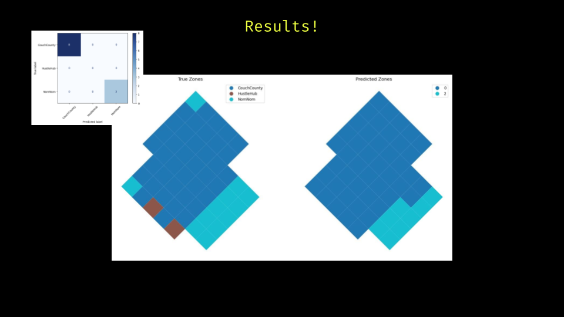

### ZONO_NAUTS.
### About This Repository
Presentation link
https://docs.google.com/presentation/d/1TVzfKjb-gqISSw54PyOh2nNhkcX3KrRm1F0NSyFUOvg/edit?usp=sharing

This repository contains proof-of-concept code developed during the **AEC TECH Hackathon 2025** hosted at **BIG Office, Barcelona**. Built by the ZONO_NAUTS team, the project explores how we can visualize, simulate, and predict urban growth patterns using **graph neural networks (GNNs)** and **Minecraft-style voxel models**.

We turned complex urban data into gamified, interpretable prototypes — not just for fun, but to open up serious questions on how cities grow and how planners, developers, and citizens can play a role in shaping that.

.png)


.png)



### About This Repository

This repository contains proof-of-concept code developed during the **AEC TECH Hackathon 2025** hosted at **BIG Office, Barcelona**. Built by the ZONO_NAUTS team, the project explores how we can visualize, simulate, and predict urban growth patterns using **graph neural networks (GNNs)** and **Minecraft-style voxel models**.

We turned complex urban data into gamified, interpretable prototypes — not just for fun, but to open up serious questions on how cities grow and how planners, developers, and citizens can play a role in shaping that.

---

###  What’s Inside

This repo is structured around a modular workflow that includes:

- ** OSMnx Data Extraction**  
  Scripts for extracting building footprints, land use, and POIs using `osmnx`.

- ** Grid-to-Graph Conversion**  
  We generate a uniform 250x250m urban grid, then convert it into a graph format for GNN training.

- ** Voxelization Prototype**  
  A simple voxelization process to convert city blocks into a Minecraft-ready `.schematic` format - used for visualizing urban patterns in a gamified digital twin.
  https://objtoschematic.com/

- ** GNN Playground (WIP)**  
  Early steps toward training a Graph Neural Network to predict zoning transitions, land use dominance, or new development zones.

---

###  How to Use

1. Clone the repository:
   ```bash
   git clone https://github.com/Nihalmannath/AEC_HACKATHON_BIG.git
   cd AEC_HACKATHON_BIG
   ```

2. Set up your Python environment (we recommend using `conda`):
   ```bash
   conda create -n zono_env python=3.9
   conda activate zono_env
   pip install -r requirements.txt
   ```

3. Run the modules:
   - `osmnx_extraction.py`: Extracts OSM data for your city.
   - `grid_graph_builder.py`: Converts grids into a graph.
   - `voxelizer.py`: Converts 3D geometry to Minecraft-style voxels.

---

### 🛠 Status

All scripts are **work-in-progress**. We welcome pull requests, forks, or feedback. This is a starting point — not a finished tool — but the vision is strong:

> _Urban development meets simulation, meets play._
